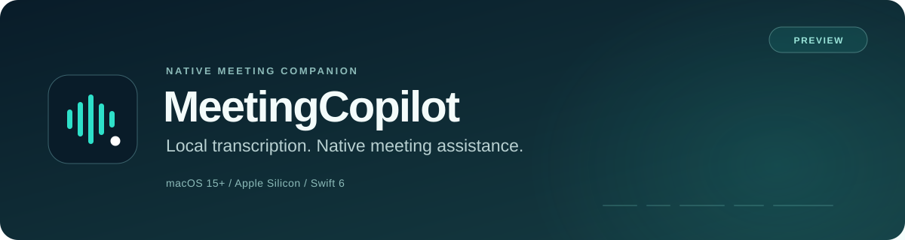

<p align="center">
  
</p>

<p align="center">
  <a href="https://github.com/4wl2d/MeetingCopilot/releases/tag/v0.1.0-preview"><strong>Download preview</strong></a>
  · <a href="#get-started">Get started</a>
  · <a href="docs/architecture.md">Architecture</a>
  · <a href="docs/verification.md">Verification</a>
  · <a href="docs/history.md">Project history</a>
  · <a href="LICENSE">Apache-2.0</a>
</p>

MeetingCopilot is a native SwiftUI/AppKit meeting companion. It transcribes audio locally, keeps a bounded conversation context, and streams Grok suggestions into a passive companion panel. You choose the audio sources and the context that may leave your Mac.

> [!IMPORTANT]
> **This is a preview with external setup requirements.** Grok subscription OAuth is the primary connection, but MeetingCopilot still needs its **own provider-issued OAuth registration and approved subscription inference access**. An ordinary Grok login is not enough. An **API key is optional**, with separate API access and billing. Local transcription can run through the explicit transcription-only mode.

## Built around the conversation

| Local speech | Deliberate context | Native controls |
| --- | --- | --- |
| On-device Parakeet TDT v3 recognition, with independent microphone and meeting-audio pipelines. | Selected profile, retained conversation, session notes and pinned facts. Screen context starts off. | Menu-bar controls, per-source pause, configurable shortcuts, and a panel that stays passive until you choose **Interact**. |

- **Audio stays on your Mac.** The production pipeline does not save or upload it. Selected text, and an explicitly permitted image when used, go to xAI for generation.
- **Corrections invalidate stale answers.** Material changes to selected context fence the old stream and reject late chunks.
- **Capture scope is explicit.** Select a meeting application, or separately choose all system audio. Browser capture covers the application, not one tab.
- **Ending a session clears volatile meeting data.** Capture, decoding and generation are cancelled; a bounded speech-model cache may stay warm.

The app does not join calls, identify individual speakers, or type into another application. Capture visibility varies by sharing software; there is no universal “invisible overlay” claim. [Privacy and permission details →](docs/privacy-and-permissions.md)

## Get started

**Target:** macOS 15.0 or later, Apple Silicon. The verified runtime host is macOS 26.6.2; macOS 15 execution has not been tested separately.

1. Download the app archive from [v0.1.0-preview](https://github.com/4wl2d/MeetingCopilot/releases/tag/v0.1.0-preview), or build from source below.
2. In **Audio / STT**, select a microphone and meeting application, grant the required macOS permissions, then download and verify the approximately **483 MB** local model.
3. In **AI**, use this application's registered OAuth client when available, explicitly choose the optional API-key connection, or enable **Transcription-only session**. [Connection setup →](docs/integration-settings.md)
4. Choose a profile in **Context** if needed, review shortcuts, then press **Start session**. Setup never starts a meeting automatically.

> [!NOTE]
> The preview app is **ad hoc signed with hardened runtime, and is not notarized**. Its integrity checks pass, but Gatekeeper assessment rejected the artifact. The last system-audio permission attempt also failed with ScreenCaptureKit `-3801`; successful simultaneous microphone/system capture has not been demonstrated. See the [verification ledger](docs/verification.md) before relying on it in a meeting.

### Build from source

Use a stable full Xcode installation. The verified toolchain is **Xcode 26.6 / Swift 6.3.3**. The scripts select `/Applications/Xcode.app` when available without changing global `xcode-select`.

```sh
git clone https://github.com/4wl2d/MeetingCopilot.git
cd MeetingCopilot
./script/build_and_run.sh
```

The script builds, stages, locally signs, and opens `dist/MeetingCopilot.app`. Use `./script/test.sh` for the ordinary test suites or `./script/package.sh` for a Release app and ZIP. [Development and validation →](CONTRIBUTING.md)

## Subscription first, with a clear boundary

The native OAuth implementation uses xAI's authorization service, a browser authentication session, PKCE/S256, state validation, refresh-token rotation and device-bound Keychain storage. The public build does not contain another application's client identity. Its registered callback is `meetingcopilot://oauth/callback`.

**Registration and entitlement remain unresolved for this application.** Support for other xAI integrations does not establish a supported subscription inference route for MeetingCopilot. The app therefore shows an actionable registration-required state. [OAuth implementation and evidence →](docs/oauth-evidence.md)

The optional API path uses your own xAI API key, stored separately in Keychain. Requests use the Responses API with bounded context, no model tools and `store:false`. This setting is not a blanket provider-retention guarantee. Live text streaming and live transcript-plus-image reasoning still require separate verification with authorized access.

## Evidence you can inspect

| Check | Recorded result | Scope |
| --- | --- | --- |
| [Application regression suites](Benchmarks/results/regression-verification.json) | **139 passed, 2 opt-in skips** in each of Debug and Release; 141 collected | Includes synthetic Keychain and native hotkey registration tests. |
| [Core tests](docs/verification.md) | **47 passed** in both Debug and Release | Independent local domain package. |
| [Clean Git checkout](Benchmarks/results/clean-checkout-verification.json) | **Debug and Release builds passed** | All 184 original tracked files matched their commit; no compiled project output reused. |
| [Four-hour paced integration soak](Benchmarks/results/integrated-soak-14400s-run.json) | **14,400 s · zero audio drops/gaps** | Real local models, licensed PCM, hidden production views and recorded short LLM answers. |
| [Soak memory and teardown](Benchmarks/results/integrated-soak-14400s.json) | **11.391 MiB RSS growth · 69.206 ms teardown** | No owned tasks or provider jobs after stop. |
| [Local package](docs/packaging-evidence.md) | **ARM64 app and ZIP integrity verified** | Ad hoc signed; not notarized. |

The four-hour workload exercised **sparse local inference alongside sustained remote inference**: decoded-window coverage was 664.84 s local and 12,837.96 s remote, including padding/silence. It was not dense two-speaker speech, a live call, or live Grok. Development builds overlapped the run. [Method and limits →](docs/benchmarks.md#completed-four-hour-paced-integration-soak)

The original latency objectives were **not met**: measured aligned partial p95 was 3,082 ms for the selected TDT backend against a 900 ms objective. Heldout question-finalization evidence contains only one recognized question. Real account access, simultaneous capture, receiver/display compatibility, and trusted distribution remain incomplete. Failed runs are preserved in the evidence. [Full verification ledger →](docs/verification.md)

## Explore the project

| Read | What it covers |
| --- | --- |
| [Architecture](docs/architecture.md) | App/domain boundaries, audio ownership, context and generation lifecycle. |
| [Privacy and permissions](docs/privacy-and-permissions.md) | What is retained, sent or exported; explicit capture compatibility matrix. |
| [Speech backend selection](docs/stt-gate.md) | Candidate comparison, pinned models, measured accuracy and latency limits. |
| [Benchmarks](docs/benchmarks.md) | Reproduction commands, workload definitions and preserved failures. |
| [Packaging](docs/packaging-evidence.md) | Source manifests, artifact hashes, signing and clean-checkout evidence. |
| [History and provenance](docs/history.md) | How the first public import was organized and how to recover the original Git history. |
| [Third-party notices](THIRD_PARTY_NOTICES.md) | Dependency and model attribution; bundled license texts. |

The [preview release](https://github.com/4wl2d/MeetingCopilot/releases/tag/v0.1.0-preview) includes the app ZIP, checksums, the original Git-history bundle, and a verification-evidence archive. Model weights and corpus audio are not included in the repository. For reproducible issues or focused contributions, see [CONTRIBUTING.md](CONTRIBUTING.md).

## License

Original project code is available under the [Apache License 2.0](LICENSE). Dependencies, model weights and benchmark data keep their own licenses and attribution; see [third-party notices](THIRD_PARTY_NOTICES.md).
