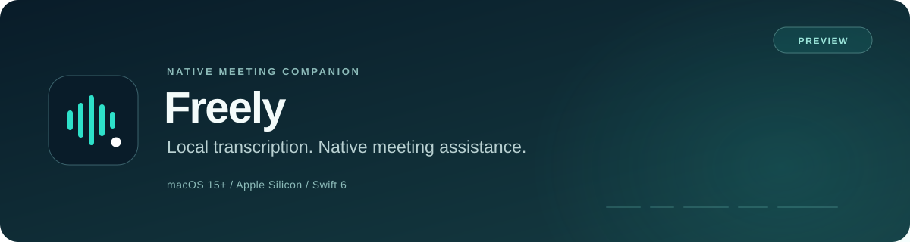

<p align="center">
  
</p>

<p align="center">
  <a href="https://github.com/4wl2d/Freely/releases/tag/v0.2.0-preview"><strong>Download preview</strong></a>
  · <a href="#get-started">Get started</a>
  · <a href="docs/architecture.md">Architecture</a>
  · <a href="docs/verification.md">Verification</a>
  · <a href="docs/history.md">Project history</a>
  · <a href="LICENSE">Apache-2.0</a>
</p>

[](https://github.com/4wl2d/Freely/actions/workflows/ci.yml)

Freely is a native SwiftUI/AppKit meeting companion. It transcribes audio locally, keeps a bounded conversation context, and streams Grok suggestions into one floating panel. You choose the audio sources and the context that may leave your Mac.

> [!IMPORTANT]
> **Freely is a native macOS preview.** Connect your Grok subscription through the official **Grok Build** client, or explicitly choose an xAI API key with separate billing. No OAuth client registration is needed for the ordinary subscription connection. Local transcription also works without an AI connection.

This branch contains the unified panel redesign. See the [panel and presentation guide](docs/unified-panel.md) and its [verification ledger](docs/glass-verification.md). The published 0.2.0 preview predates this redesign.

For development, open **Actions → Diagnostics** for live events, pipeline health, timing distributions, and safe JSON reports. See the [debugging guide](docs/debugging.md) for reproduction, LLDB, and crash/hang capture workflows.

## Built around the conversation

| Local speech | Deliberate context | Native controls |
| --- | --- | --- |
| On-device Parakeet TDT v3 recognition, with independent microphone and meeting-audio pipelines. | Selected profile, retained conversation, session notes and pinned facts. Screen context starts off. | Menu-bar controls, per-source pause, configurable shortcuts, and one panel that stays passive until you click its text or fields. |

- **Audio stays on your Mac.** The production pipeline does not save or upload it. Selected text, and an explicitly permitted image when used, go to xAI for generation.
- **Corrections invalidate stale answers.** Material changes to selected context fence the old stream and reject late chunks.
- **Capture scope is explicit.** Select a meeting application, or separately choose all system audio. Browser capture covers the application, not one tab.
- **Ending a session clears volatile meeting data.** Capture, decoding and generation are cancelled; a bounded speech-model cache may stay warm.

The app does not join calls, identify individual speakers, or type into another application. The optional controlled presentation output has its own source and interface visibility control; receiver compatibility is tracked separately. [Privacy and permission details →](docs/privacy-and-permissions.md)

## Get started

**Target:** macOS 15.0 or later, Apple Silicon. The verified runtime host is macOS 26.6.2; macOS 15 execution has not been tested separately.

1. Download [Freely 0.2.0 preview](https://github.com/4wl2d/Freely/releases/tag/v0.2.0-preview), unzip it, and move **Freely.app** to **Applications**.
2. Open **Settings → Audio & Speech**. Enable the sources you need, choose your meeting application, request microphone access if enabled, and download the approximately **483 MB** speech model. macOS may require **Quit & Reopen** after you enable Screen & System Audio Recording.
3. Open **Settings → Connections → Connect Grok**. Freely reuses an existing [official Grok Build](https://docs.x.ai/build/overview) sign-in or opens its browser sign-in. The button runs a short subscription test and reports the result. Install Grok Build first if the app shows **Install Grok Build**. An API key or **Transcription-only session** are alternative choices.
4. Optionally add a profile or notes in **Context**, then press **Start session**. Speak or play meeting audio, wait for the transcript, and type a question and press **Ask** when needed. Direct questions in meeting audio can trigger answers automatically.
5. **Actions → Pause all sources** suspends capture; **Actions → End session** confirms the end and clears retained session data. **Hide Freely** keeps capture running.

The first Freely launch copies existing settings and speech models from the former app when no Freely copy exists. It preserves the originals. macOS permissions belong to the new app identity and must be granted again.

> [!NOTE]
> This preview is **ad hoc signed and not notarized**. macOS may block the first launch until you explicitly allow it in **System Settings → Privacy & Security**. A Developer ID certificate and notarization credentials are required for trusted distribution; they are not bundled in this repository.

### Build from source

Use a stable full Xcode installation. The verified toolchain is **Xcode 26.6 / Swift 6.3.3**. The scripts select `/Applications/Xcode.app` when available without changing global `xcode-select`.

```sh
git clone https://github.com/4wl2d/Freely.git
cd Freely
./script/build_and_run.sh
```

The script builds, stages, locally signs, and opens `dist/Freely.app`. Use `./script/test.sh` for the ordinary test suites or `./script/package.sh` for a Release app and ZIP. [Development and validation →](CONTRIBUTING.md)

## Grok subscription connection

Freely runs the official Grok Build client through its supported headless interface. The client handles grok.com authentication, token refresh and subscription routing. Freely never imports its token contents or borrows an OAuth client identity. **Grok Build 1.0.13** was tested on the development Mac.

Each request uses a private temporary workspace, disables tools, imported rules/hooks, memory and conversation writeback, and sends only Freely's selected context plus an explicitly allowed image. Temporary client files are removed after the process exits. Ending a session cancels and waits for its requests. **Disconnect** disconnects Freely without signing you out of other Grok Build sessions. Provider retention and subscription limits remain governed by your xAI account.

The optional direct API connection keeps its key in Keychain and uses the Responses API with `store:false`. It never activates as an automatic fallback from a subscription failure. The advanced native OAuth registration field is only for a separately registered integration. [Connection details and evidence →](docs/oauth-evidence.md)

## Evidence you can inspect

The [Freely first-meeting verification](docs/first-meeting-ux.md) records the current rebrand, subscription and UX checks. The table below preserves the original pre-rebrand measurements; those long-soak results have not been re-run for this change.


| Check | Recorded result | Scope |
| --- | --- | --- |
| [Application regression suites](Benchmarks/results/regression-verification.json) | **139 passed, 2 opt-in skips** in each of Debug and Release; 141 collected | Includes synthetic Keychain and native hotkey registration tests. |
| [Core tests](docs/verification.md) | **47 passed** in both Debug and Release | Independent local domain package. |
| [Clean Git checkout](Benchmarks/results/clean-checkout-verification.json) | **Debug and Release builds passed** | All 184 original tracked files matched their commit; no compiled project output reused. |
| [Four-hour paced integration soak](Benchmarks/results/integrated-soak-14400s-run.json) | **14,400 s · zero audio drops/gaps** | Real local models, licensed PCM, hidden production views and recorded short LLM answers. |
| [Soak memory and teardown](Benchmarks/results/integrated-soak-14400s.json) | **11.391 MiB RSS growth · 69.206 ms teardown** | No owned tasks or provider jobs after stop. |
| [Local package](docs/packaging-evidence.md) | **ARM64 app and ZIP integrity verified** | Ad hoc signed; not notarized. |

The four-hour workload exercised **sparse local inference alongside sustained remote inference**: decoded-window coverage was 664.84 s local and 12,837.96 s remote, including padding/silence. It was not dense two-speaker speech, a live call, or live Grok. Development builds overlapped the run. [Method and limits →](docs/benchmarks.md#completed-four-hour-paced-integration-soak)

The original latency objectives were **not met**: measured aligned partial p95 was 3,082 ms for the selected TDT backend against a 900 ms objective. Heldout question-finalization evidence contains only one recognized question. The original run did not establish real account access or simultaneous capture. Current subscription and capture checks are recorded separately; receiver/display compatibility and trusted distribution remain incomplete. Failed runs are preserved in the evidence. [Full verification ledger →](docs/verification.md)

## Explore the project

| Read | What it covers |
| --- | --- |
| [Architecture](docs/architecture.md) | App/domain boundaries, audio ownership, context and generation lifecycle. |
| [Privacy and permissions](docs/privacy-and-permissions.md) | What is retained, sent or exported; explicit capture compatibility matrix. |
| [Speech backend selection](docs/stt-gate.md) | Candidate comparison, pinned models, measured accuracy and latency limits. |
| [Benchmarks](docs/benchmarks.md) | Reproduction commands, workload definitions and preserved failures. |
| [Packaging](docs/packaging-evidence.md) | Source manifests, artifact hashes, signing and clean-checkout evidence. |
| [History and provenance](docs/history.md) | How the first public import was organized and how to recover the original Git history. |
| [Third-party notices](THIRD_PARTY_NOTICES.md) | Dependency and model attribution; bundled license texts. |

The [Freely preview](https://github.com/4wl2d/Freely/releases/tag/v0.2.0-preview) contains the current app ZIP and checksum. The [original preview archive](https://github.com/4wl2d/Freely/releases/tag/v0.1.0-preview) preserves the old app, Git-history bundle and verification evidence. Model weights and corpus audio are not included in the repository. For reproducible issues or focused contributions, see [CONTRIBUTING.md](CONTRIBUTING.md).

## License

Original project code is available under the [Apache License 2.0](LICENSE). Dependencies, model weights and benchmark data keep their own licenses and attribution; see [third-party notices](THIRD_PARTY_NOTICES.md).

For routine checks without visible windows, use `./script/harness.py start`; `status` shows progress and `stop` cancels only the harness. See the [background test guide](docs/testing-harness.md).
