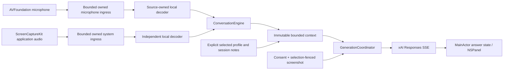

# Architecture and source ledger

The default subscription path uses `GrokBuildConnection` and `GrokBuildProvider`, composed through `SelectedLLMProvider`. The optional API/native-registration route retains `XAILLMProvider`. Both implement `LLMProviding`; the conversation engine and session coordinator retain their cancellation and context ownership. [Connection contract](oauth-evidence.md).

Freely is one Swift 6 macOS application, packaged from a checked-in SwiftPM executable target. `Packages/FreelyCore` contains platform-independent value types, actors, bounded domain algorithms and tests. No bot, cloud backend, meeting SDK, Python inference server, event bus or DI framework is shipped.

## Ownership and flow

- `SessionCoordinator` invalidates epochs synchronously, owns preparation/monitor/source operation/decoder task sets, and orchestrates pause/resume/stop. Source failures remain independent.
- Native audio callbacks copy PCM before returning. They never infer, await an actor, perform network/file work or spawn a task per callback. Owned ingress uses a nonblocking bounded buffer; measured overflow is delivered as a discontinuity.
- `SourcePipeline` owns conversion, VAD/window state, source epoch, stable hypothesis segment ID/revision and its independent transcriber. Core ML work runs off MainActor. A cancelled inference is awaited before decoder cleanup.
- `LocalSpeechModelCache` holds at most two independently loaded immutable model sets. Session-owned managers/decoder states are not cached. Loading uses only verified local files; SDK automatic model download paths are not used.
- `ConversationEngine` reconciles timestamp-ordered revisions, constructs turns, detects questions, commits revision-fenced summaries and builds bounded snapshots. Generated suggestions retain separate provenance and are never represented as speech.
- `GenerationCoordinator` owns one foreground generation and one newest pending intent, summary priority/cooldown, speculation admission and final UI fences. The provider owns native URLSession producers and retry deadlines. Teardown awaits both consumers and transports.
- `ApplicationModel` composes the existing session/generation owners. `ShellWindowController` owns the only user panel. `ShellState` retains navigation, shared popup selection and focus bookmarks; native retained page hosts preserve text/scroll state. `PanelDialogCoordinator` owns attached file sheets and their invalidation fence. Actions overlays the current retained page and exclusively owns keyboard input while open. The local `PanelBackdrop` and transparent SwiftUI content host are siblings; only the content host is cached for presentation, over an opaque graphite backing. Ordinary output mutations never activate the application.
- `PresentationCoordinator` independently owns ScreenCaptureKit capture, one newest source-frame slot, synchronous revision-checked composition, a bounded panel bitmap cache and a non-key output window. System UI and source failure neutralize that output before asynchronous cleanup. See [panel architecture and behavior](unified-panel.md).
- OAuth and API-key credentials are separate Keychain owners. Subscription OAuth is preferred; a router never silently substitutes a stored API key when subscription authentication fails.

## Invariants and limits

Session, source, question, selection and generation identities fence asynchronous work. Partial hypotheses replace their segment; higher-revision final corrections remain allowed. Retractions and bounded retirement watermarks reject late resurrection. Source timestamps and deterministic tie-breakers determine presentation, not callback arrival.

Initial caps: ingress 2 s/source, analysis window 15 s/source, transcript 10 min / 2,000 segments / 2 MiB, 20 question-answer pairs with a separate 128 KiB cap, one active visual snapshot, one newest pending intent, 30 UI error messages and bounded performance sample reservoirs. Explicit model/transport constants live outside conversation logic.

Text requests allocate 16,000 estimated input tokens across instructions, selected context, pinned facts, summary, related questions/suggestions, active question/antecedent, recent turns and framing. The estimator uses conservative UTF-8 byte accounting; it is not a tokenizer. Active questions that cannot fit are rejected with an action instead of being cut through a qualification. A visual request adds an 8,000-token conservative image allowance and obeys the combined 24,000 estimated-token ceiling plus actual model reserves.

Summary construction is asynchronous and lower priority than answers. Commits check source references/revisions/epochs and gaps. Offline/failing summary work uses bounded extractive preservation; incomplete history remains visible. Profile or material context deselection invalidates pending generations and prior suggestions that could carry that context.

## Native distribution decisions

- Minimum macOS 15, arm64, Swift 6. Stable Xcode selected per process. Native resources use `Bundle.main` in `Contents/Resources`, avoiding SwiftPM's development resource path fallback.
- Direct distribution with hardened runtime and audio-input entitlement; App Sandbox is not enabled. No JIT/unsigned-memory/library-validation exceptions are added.
- AVFoundation selects an explicit microphone UID or follows default without changing the global device. ScreenCaptureKit microphone capture is disabled to avoid duplication.
- System audio registers an audio output only; the app receives no screen frames for audio-only capture. This does not assert that macOS performs no internal display work.
- ScreenCaptureKit screenshot APIs are on-demand, SDR/sRGB, source/crop/selection-fenced, maximum 2048-pixel long edge and 4 MiB. Own application windows are excluded. No public image hosting or OCR prerequisite exists.
- Carbon hotkeys provide twelve configurable actions without blanket keyboard observation or Accessibility permission. The presentation-visibility action has no default global binding.
- `NSPanel` stays at ordinary floating level and becomes key only after interaction. Hosting views do not determine window size. No `sharingType` guarantee is used; own-process exclusion belongs to the controlled ScreenCaptureKit output. Native selectable text is included through AppKit bitmap caching.

## Source ledger

Accessed 2026-09-07. Documentation evidence is distinct from local runtime tests. Exact dependency source was also inspected under resolved checkouts.

| Source / API | Decision | Remaining uncertainty |
| --- | --- | --- |
| [Apple ScreenCaptureKit](https://developer.apple.com/documentation/screencapturekit) | Application/display/window filters, audio output, documented usage description | Actual capture by every meeting provider/version is not guaranteed. |
| [Apple capture sample](https://developer.apple.com/documentation/screencapturekit/capturing-screen-content-in-macos) | SCShareableContent/SCContentFilter/SCStream; minimum macOS 15 | Permission/restart behavior varies by signature and OS; manual matrix required. |
| [SCStreamConfiguration.capturesAudio](https://developer.apple.com/documentation/screencapturekit/scstreamconfiguration/capturesaudio) | Separate audio output; no microphone duplication | No browser-tab isolation claim. |
| [Apple NSAudioCaptureUsageDescription](https://developer.apple.com/documentation/bundleresources/information-property-list/nsaudiocaptureusagedescription) | System-audio purpose string; microphone/screen purpose strings also declared | Actual runtime prompt/permission is checked, not inferred from a plist key. |
| [ASWebAuthenticationSession](https://developer.apple.com/documentation/authenticationservices/aswebauthenticationsession) | Native external browser authentication | Own provider registration/callback approval still required. |
| [xAI OAuth discovery](https://auth.x.ai/.well-known/openid-configuration) | Actual issuer/endpoints, public-client PKCE, S256 and refresh grant | No advertised registration endpoint; no custom app entitlement established. |
| [xAI OpenCode integration](https://x.ai/news/grok-opencode) | Subscription-backed OAuth exists for a named integration | Its identity/token cannot be reused as Freely's registration. |
| [RFC 8252](https://www.rfc-editor.org/rfc/rfc8252), [RFC 7636](https://www.rfc-editor.org/rfc/rfc7636) | External user agent, PKCE, state/callback checks, no embedded secret | Interoperability needs registered-client live verification. |
| [Grok 4.6](https://docs.x.ai/developers/grok-4-6), [reasoning](https://docs.x.ai/developers/model-capabilities/text/reasoning) | Configurable real model; low effort; Responses text+image capability | Account/model access and latency remain live checks. |
| [Text generation](https://docs.x.ai/developers/model-capabilities/text/generate-text), [streaming](https://docs.x.ai/developers/model-capabilities/text/streaming) | store:false, bounded client context, typed SSE and terminal states | Provider-specific live terminal/usage traces not replaced by fixtures. |
| [xAI image understanding](https://docs.x.ai/developers/model-capabilities/images/understanding) | Inline PNG/JPEG image inputs | Image token estimate is conservative, not exact billing. |
| [FluidAudio 0.15.6](https://github.com/FluidInference/FluidAudio/tree/v0.15.6) | Direct Core ML / AsrModels initialization; independent manager and decoder state | Production selection gated by measured comparison; upstream convenience stream not used. |
| [Pinned TDT model](https://huggingface.co/FluidInference/parakeet-tdt-0.6b-v3-coreml/tree/7dd20fe6b1797d35f5e3307e8b1732d9a178edfe) | Verified 21-file manifest, mono 16 kHz, CC BY 4.0 | English tested; no extra language menu without evidence. |
| [WhisperKit](https://github.com/argmaxinc/argmax-oss-swift), [whisper.cpp](https://github.com/ggml-org/whisper.cpp), [Parakeet MLX](https://github.com/senstella/parakeet-mlx) | Real candidate comparison, not production demos/services | See STT gate for classification and rejected/unmet criteria. |
| [AMI corpus](https://groups.inf.ed.ac.uk/ami/download/) | Licensed natural meeting data and manual annotations | One-meeting population/technical-vocabulary limitations remain explicit. |

Detailed transport, OAuth, native-adapter and STT ledgers are in their focused evidence documents. No documentation row is treated as a completed runtime check.
