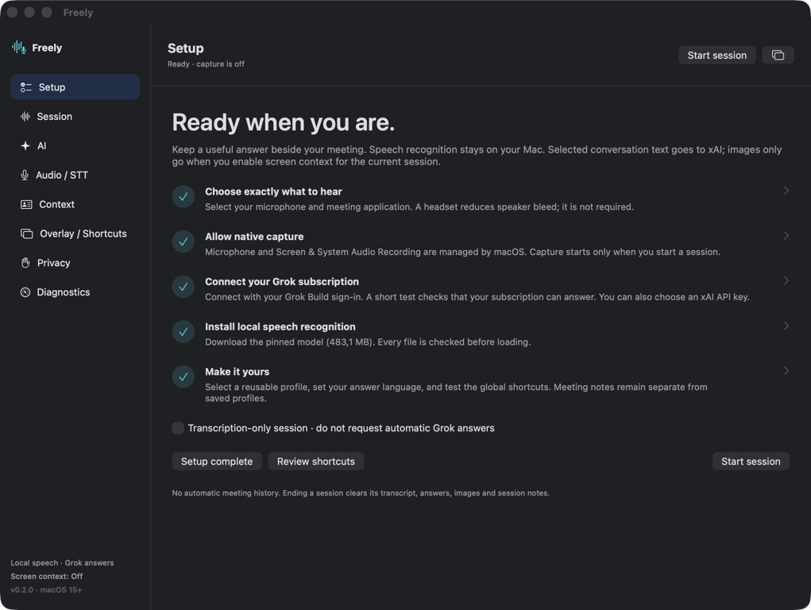
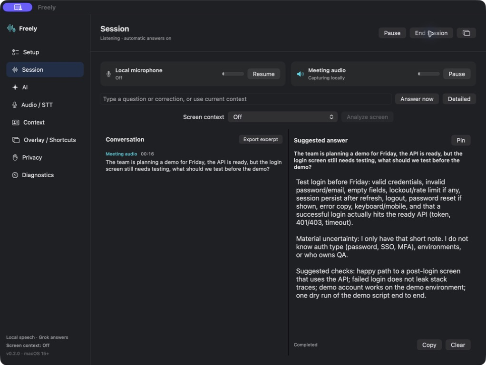
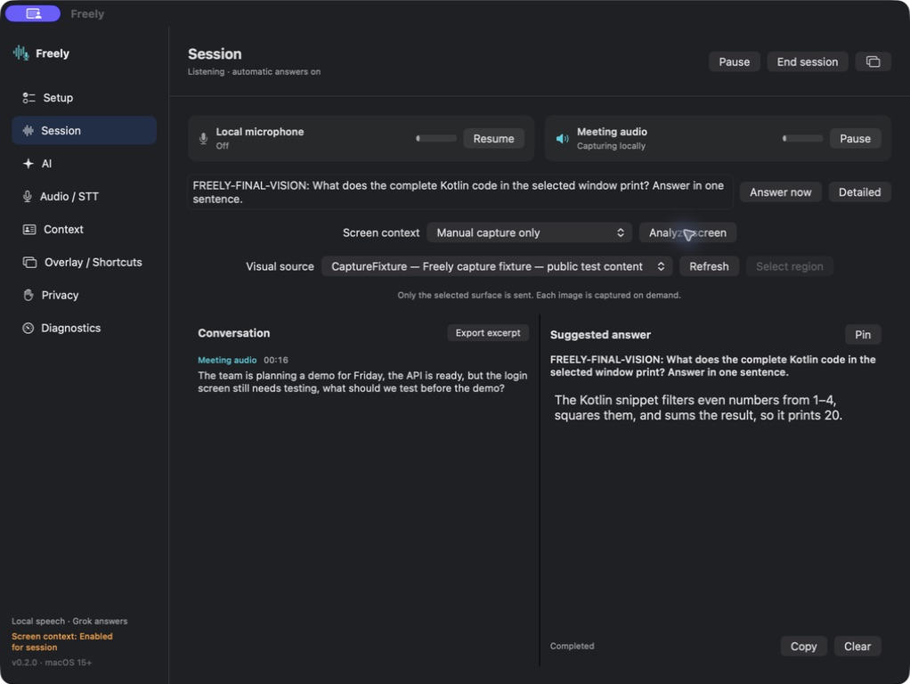

# Freely 0.2.0 — installation and first-meeting verification

The path from installation to a controlled first meeting works on the tested Mac: subscription connection, model download, native capture and transcription, automatic answers, selected-window reasoning, pause/resume and clean session termination. The permission indicator now acknowledges an OS grant before capture starts.

Checked on **2026-09-08**, **macOS 26.6.2 / Apple Silicon**, with **Grok Build 1.0.13** and the user's existing grok.com subscription. [Machine-readable record and artifact hashes](../Benchmarks/results/freely-0.2.0-verification.json).

## Flow and results

| Step | Health | Evidence |
| --- | --- | --- |
| 1. Install and restore | Passed on this account. Extracted the release ZIP into Applications; the installed bundle matches every extracted file. Legacy preferences/models were copied without deleting their originals. | [Ready screen](assets/ux/setup-ready.png) |
| 2. Permissions and model | Passed. Microphone and screen access acknowledged; the complete 483.1 MB model downloaded through the UI and passed verification. | [Download progress](assets/ux/model-download.png), [microphone diagnostics](assets/ux/microphone-check.png) |
| 3. Connect Grok | Passed. Connect shows progress and tests a real `grok-4.6` answer. Disconnect affects Freely only; reconnect and restoration after launch worked. | [Connected state](assets/ux/grok-connected.png) |
| 4. First meeting | Passed. CaptureFixture played synthetic English speech. The transcript retained the introductory statement and detected the final question, triggering a real automatic answer. | [Transcript and answer](assets/ux/meeting-answer.png) |
| 5. Selected image | Passed after correcting the capture bounds. The actual outgoing PNG shows the complete test window; Grok correctly explains that the Kotlin code prints `20`. | [Actual outgoing image](assets/ux/window-capture.png), [answer](assets/ux/window-answer.png) |
| 6. Pause, resume and end | Passed after correcting the source state machine. A disabled microphone stays Off. Ending an active Grok request cancelled its process; session teardown was 0.0968 s, with zero child processes and zero temporary request directories afterward. Transcript/answer/image selection cleared. | [Resume state](assets/ux/resume-sources.png), [cleared session](assets/ux/ended-session.png) |
| 7. Local microphone and handback | Passed. Native 48 kHz input and local decoding were observed in transcription-only mode, with no Grok request. Mic teardown was 0.037 s. Original mic/system-audio settings were restored; Freely was left idle with all setup checks complete. | [Local diagnostics](assets/ux/microphone-check.png), [ready screen](assets/ux/setup-ready.png) |

## Defects found and fixed

- **Connect did nothing:** the previous default path required a missing native OAuth registration. The ordinary connection now runs the official Grok Build client, with visible progress, cancellation and actionable errors. No client identity or token is copied into Freely.
- **Granted permission looked missing:** setup previously waited for a successful capture rather than recognizing the OS permission. The badge now reflects granted permissions for enabled inputs, with an actual-capture fallback for an audio-only grant.
- **Questions after statements were missed:** the recognized comma-separated test sentence ended in a direct question. The detector now also examines the final clause while preserving the whole turn as context.
- **Streaming/cancellation was delayed:** a buffered pipe read waited for a full buffer or EOF. Bounded POSIX reads now deliver incremental output and cancellation promptly.
- **A moved window was cropped:** an explicit zero-origin source rectangle clipped a window positioned elsewhere on the desktop. Full-window capture now leaves the source rectangle implicit; only an intentional region overrides it. The outgoing PNG was inspected before accepting the fix.
- **Resume falsely showed a disabled microphone as recording:** phase resumption no longer marks native inputs Running. Each source is reported active only after its capture adapter confirms startup; disabled sources stay Off.

The parallel diagnostics work added a bounded event console, source/request correlation, timing views, classified failures and safe JSON export. Copy/export, filtering, pause, markers and row details were exercised separately; see [the debugging guide](debugging.md).

## Regression and provenance

- **49 core tests passed.**
- **171 native tests discovered: 165 passed, six explicit opt-in skips.** Debug and Release are checked by [macOS CI](https://github.com/4wl2d/Freely/actions/workflows/ci.yml). Live subscription usage is opt-in and was exercised separately.
- ShellCheck passed for the changed build, package, test, fixture and diagnostics scripts.
- The installed/released executable was built from `0c8053082065` with a clean tree. Later changes repair a test macro and add this report; production build inputs remain byte-identical. The executable and ZIP hashes are in the JSON record.
- The meeting/image screenshots were captured after their fixes, before the final pause-state correction. The installed final bundle additionally passed pause/resume, in-flight cancellation, local-mic and restored-setup checks. They are not mislabeled as a new four-hour soak.

## macOS permission recovery

Ad hoc rebuilds change the app's code signature. macOS can retain a grant for the previous signature while still showing its toggle enabled. This was confirmed during testing; toggling alone did not update the binding. Quitting Freely, removing its stale Screen & System Audio Recording entry, and adding `/Applications/Freely.app` again restored capture. macOS may ask for Touch ID/password and Quit & Reopen. A scoped developer reset (`tccutil reset ScreenCapture local.freely.app`) was used to re-test that grant; it revokes the old permission and does not grant access by itself.

The preview is **ad hoc signed and not notarized**. A Developer ID/notarization setup is needed for trusted distribution. No global security setting or other app's capture grant was modified by the recovery command.

## Limits

These are checks on the existing user account and Mac, using controlled English speech and a public test window. A fresh account/login, macOS 15 runtime, other hardware, broad accents/languages, a Zoom/Teams/browser receiver matrix, full-screen/display-change behavior and a new long simultaneous-capture soak are not established by them. Provider retention and subscription limits remain governed by the user's xAI account. The [original verification ledger](archive/verification-2026-09-07.md) remains preserved separately.
