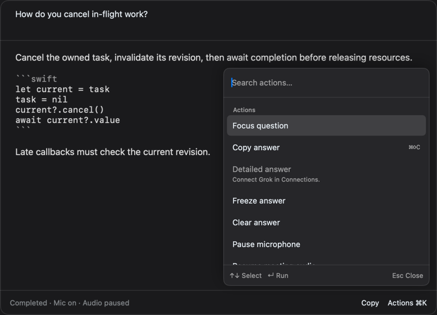
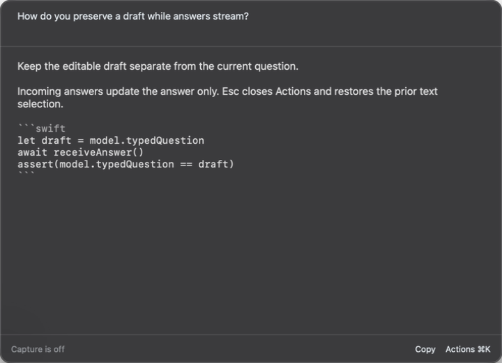
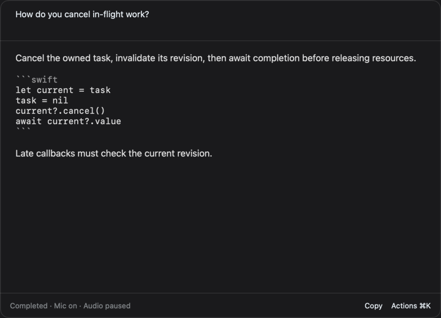
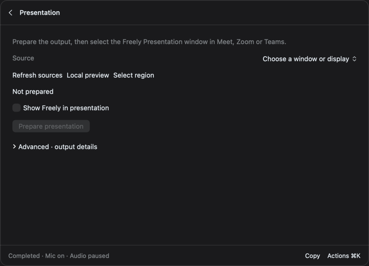
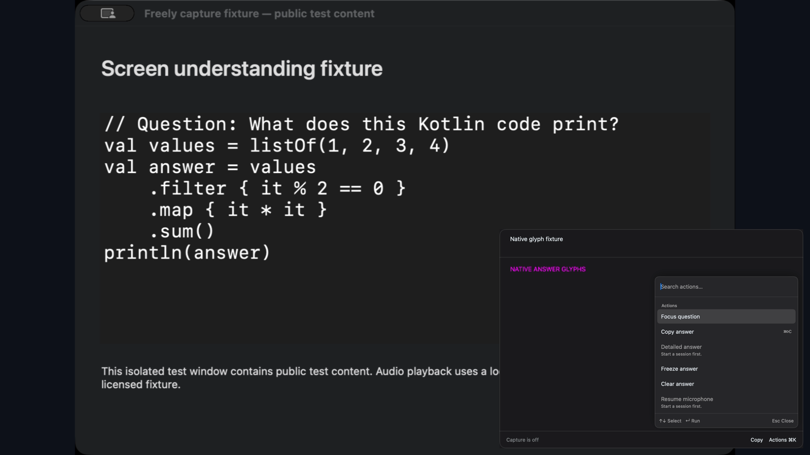
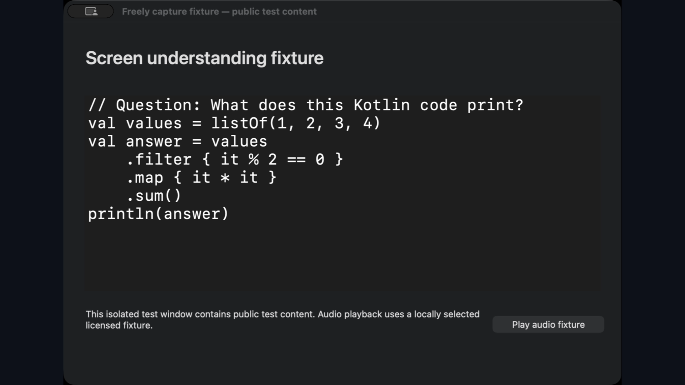
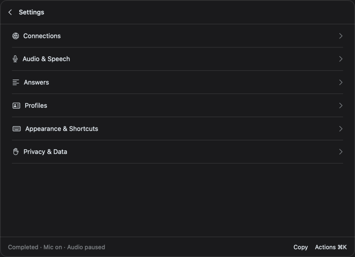

# Freely panel and presentation

The interface is in English. Set the response language in **Settings → Answers**.

Freely has one floating panel for readiness, answers, transcript, context, settings and diagnostics. The optional **Freely Presentation** window contains the composed video output. It carries no audio.

## Open, focus and hide

New installations use **Control–Option–Space** to toggle the whole panel and **Control–Option–Return** to focus the question. Existing shortcut assignments survive migration. The menu-bar icon toggles the same panel and contains no meeting text or status details.

Click a field or selectable answer to interact. Streaming and errors do not activate Freely or open a hidden panel. Hiding preserves the current page, drafts, scroll and selection, and returns focus to the previously active app. Audio, transcription and generation continue.

| Command | Action |
| --- | --- |
| Command–K | Search actions and navigate within the panel |
| Command–comma | Open Settings |
| Command–[ | Back |
| Escape | Close the current choice, action list or confirmation; otherwise go back; hide at the root |
| Command–W | Hide the entire panel immediately |
| Enter in the question | Send the question |
| Shift–Enter in the question | Insert a line break |
| Command–C | Copy the native text selection |
| Command–Shift–C | Copy the whole answer |

Local Command shortcuts use physical key positions and keep working in the Russian input layout. Multiline profile and settings fields keep normal Enter behavior. Shortcut conflicts remain visible under **Appearance & Shortcuts**, with actions available through Command–K.

The answer starts with the question field and ends with one status row, **Copy**, and **Actions ⌘K**. Other pages have a compact title and Back. **Lock position**, **Freeze**, **Detailed answer**, size, source pauses and presentation visibility are in Actions. Unlock position to drag the free title/footer area or resize. Freeze holds the displayed answer independently of the window lock.

**Command–K** opens a 340-point action panel at the bottom right, up to 360 points high and constrained by the window. The current page stays visible. Current-page actions precede section navigation. Search matches names and keywords; unavailable actions show a reason and cannot run. Use **↑/↓** to move the visible highlight, **Enter** to run it and **Esc** to dismiss. The popup owns the keyboard; closing it restores the previous text field and cursor when that page is still visible.

Selectors use the same highlight and keyboard behavior. A checkmark marks the committed value. Arrows only preview a choice; Enter commits it. Esc, Cancel or clicking outside preserves the old value. Nested choices close before their parent action panel.

The compact panel is 720 × 520 points, and **Expand** uses 960 × 700. Manual sizes and positions are retained per display UUID and size mode. Reopening restores the same panel; a restart returns it to the last available display. Minimum size is 600 × 420, constrained to the available screen. Answer updates do not change window size. The dark graphite glass uses native `NSVisualEffectView` blur with a 75% graphite shade. Text and controls remain opaque; the window itself is never faded. **Settings → Appearance & Shortcuts → Translucent background** switches to a solid surface. System **Reduce Transparency** also forces a solid background. **Reduce Motion** disables native window transitions; page and popup changes use no animation.

## Start and use a session

Readiness lists audio and permissions, the verified local speech model, and the Grok connection. Open any item to fix its setup, then go back. Choose **Transcription only** if you want local transcription without answers. Starting always requires **Start session**; completing setup never starts capture.

Preparation shows the real model-loading or source-start stage. **Actions → Cancel preparation…** asks before stopping. Each audio source has its own state and pause action. Open **Transcript**, **Context**, **Screen context** and **Presentation** from Actions.

The top field shows the current question when no draft exists. Typing creates a separate editable draft; incoming answers never replace it. Enter requests an answer, Shift–Enter inserts a newline. Rejected submission keeps the draft. The editable text remains available after submission until edited or cleared, while the displayed answer retains its own question. Navigation, Hide and answer updates preserve native selection and scroll.

The answer distinguishes waiting, generating, receiving, completed, interrupted, failed and cancelled states. **Detailed** submits a new request for the displayed question. **Expand** only changes presentation. **Freeze** retains the displayed answer while replacement work continues; **Actions → Unfreeze answer** reveals a pending replacement.

**Transcript** is a selectable, timestamped retained excerpt. Source labels, interim fragments and audio gaps remain explicit. Scrolling back stops following; **Jump to latest** resumes it. Export includes retained-excerpt framing, timestamps, interim status and gaps, not a claim to have recorded the whole meeting.

**Context** separates session notes and pinned facts from reusable profiles. Create, select, edit, import or delete a profile. Imported files are copied into the profile and remain untouched. Session text is cleared when the session ends; profile content remains saved locally.

## Screen context for answers

Choose the AI screen mode and a window, display or region explicitly for each session. A local preview does not send an image to Grok. The region editor runs inside the panel, supports zoom and numeric coordinates, and applies the crop only after **Use region**. Cancel retains the previous crop. A changed session or source invalidates a late selection callback.

**Capture and analyze** submits an image only under the selected AI consent. These controls and the presentation source are independent.

## Prepare a presentation

1. Open **Presentation**.
2. Refresh sources, choose a window or display, and check **Local preview**. For a display crop, select and confirm a region, then check the new preview.
3. Click **Prepare presentation**.
4. In Meet, Zoom or Teams, select the window named **Freely Presentation** for sharing.
5. Use **Show Freely in presentation** to add or remove the panel. It is off by default.

The output is 1920 × 1080 at up to 30 fps. The source is fitted without distortion. When enabled, the panel is composited at the bottom right with a 16-pixel margin and proportional scaling when needed. AppKit renders only the transparent content host, including native answer text and the overlaid action/choice lists. A separate opaque graphite backing is drawn under that interface in the output. The local native blur is a sibling of the content host and is excluded from the snapshot, so the desktop behind the local panel cannot enter the interface layer.

Freely excludes its own process from its display capture stream, including the panel and the output window. The display crop excludes the menu bar and Dock area; the content filter also excludes Dock and SystemUIServer applications. This uses [ScreenCaptureKit content filters](https://developer.apple.com/documentation/screencapturekit/sccontentfilter), not `NSWindow.sharingType`.

**Hide Freely** removes the panel layer but leaves the source running. Showing the panel again respects the chosen presentation mode. Hiding invalidates the old visibility revision, drops the cached panel image and publishes a safe frame before reporting the new published revision.

Source changes, interrupted capture, system lock/sleep and capture failure produce a neutral frame. There is no fallback to a wider source. External authorization, permissions and file dialogs pause the output on a neutral frame. Check the source and prepare explicitly to resume. Ending a session clears session data and neutralizes the output; its window remains until **Close output** or application exit.

The status describes Freely's published output. It cannot confirm that a recipient is receiving it, and cannot recall previously transmitted frames. Sharing a screen directly in another app is outside this controlled output. Receiver checks for Meet, Zoom and Teams are tracked separately in the [glass verification ledger](glass-verification.md).

## Settings, diagnostics and ending

**Settings** contains Connections, Audio & Speech, Answers, Profiles, Appearance & Shortcuts, and Privacy & Data. Technical answer limits and model parameters are under **Advanced**. Version 1–2 preferences migrate to version 3 while preserving profiles, connection settings and custom shortcuts. Existing v3 settings default `translucentBackground` to true without changing profiles, shortcuts or stored geometry. Legacy overlay values remain stored; the unified panel's interaction and geometry rules take precedence.

**Diagnostics** has Overview, Events, Timings and Environment pages, event search/filtering, event details, copy and JSON export. **Expand** enlarges the same panel. Diagnostic reports contain metadata, not meeting text, images or credentials.

The footer reports microphone and meeting-audio status. Actions contains independent microphone and meeting-audio pauses plus Pause/Resume all. **End session**, available in Actions or by its configured shortcut, opens an inline confirmation. Hiding does not end a session. System file dialogs are attached to the panel; hiding cancels an unfinished selection and fences its callback.

All screenshots in this guide are rendered synthetic fixtures, not private meeting content or proof of a live recipient's view.
